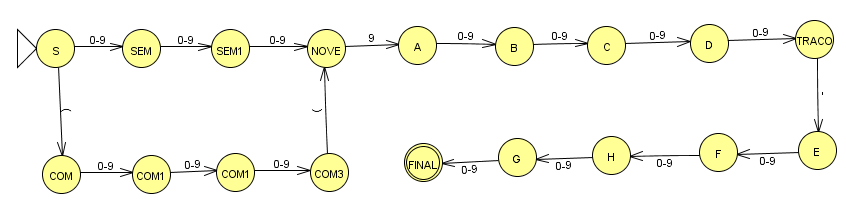

# Trabalho de Autômatos

Este repositório contém a implementação de um projeto relacionado ao estudo de autômatos, desenvolvido em Python. Os scripts e dados presentes no repositório têm como objetivo trabalhar com autômatos finitos determinísticos (AFD) e não determinísticos (AFN), realizando operações como análise de variáveis e execução de transições.

## Estrutura do Repositório

### Diretórios

- **`.vscode/`**: Configurações do editor Visual Studio Code para o projeto.
- **`data/`**: Diretório destinado aos arquivos de dados utilizados no projeto.

### Arquivos

- **`automato.py`**: Implementação principal para lidar com autômatos, incluindo funções para criar, manipular e simular transições em AFDs e AFNs.
- **`parse_variables.py`**: Script para processar e interpretar variáveis de entrada que representam autômatos ou estados.
- **`script.py`**: Arquivo de execução principal, onde os autômatos são processados e as operações específicas são realizadas.

## Como Executar

1. **Clone o Repositório:**
   ```bash
   git clone https://github.com/gabrielprestesperini/trabalho-automatos.git
   cd trabalho-automatos
   ```

2. **Execute o Script Principal:**
   ```bash
   python script.py <arquivo_glud> <arquivo_palavras>
   ```
   - `<arquivo_glud>`: Caminho para o arquivo contendo a Gramática Linear Unitária à Direita (GLUD) que define o autômato dentro do padrão definido pelo trabalho.
   - `<arquivo_palavras>`: Caminho para o arquivo contendo as palavras separadas por vírgula que serão testadas pelo autômato.

## Funcionalidades

- **Criação de autômatos:** Suporte a AFD e AFN.
- **Manipulação de estados e transições:** Definição de estados iniciais, finais e transições entre estados.
- **Processamento de variáveis:** Interpretação de representações textuais de autômatos.
- **Execução de autômatos:** Simulação de entradas para verificar aceitação ou rejeição.

## Exemplo
   ```bash
   python script.py data/glud.txt data/words.txt
   ```

   **A GLUD:**
   ```bash
   Telefone=({S,COM,COM_1,COM_2,COM_3,SEM,SEM_1,SEM_2,NOVE,A,B,C,D,E,F,G,H,TRAÇO}, {0, 1, 2, 3, 4, 5, 6, 7, 8, 9, "(", ")", -}, P, S)
   P = {
      S -> (COM | 0SEM | 1SEM | 2SEM | 3SEM | 4SEM | 5SEM | 6SEM | 7SEM | 8SEM | 9SEM,
      COM -> 0COM_1 | 1COM_1 | 2COM_1 | 3COM_1 | 4COM_1 | 5COM_1 | 6COM_1 | 7COM_1 | 8COM_1 | 9COM_1,
      COM_1 -> 0COM_2 | 1COM_2 | 2COM_2 | 3COM_2 | 4COM_2 | 5COM_2 | 6COM_2 | 7COM_2 | 8COM_2 | 9COM_2,
      COM_2 -> 0COM_3 | 1COM_3 | 2COM_3 | 3COM_3 | 4COM_3 | 5COM_3 | 6COM_3 | 7COM_3 | 8COM_3 | 9COM_3,
      COM_3 -> )NOVE,
      SEM -> 0SEM_1 | 1SEM_1 | 2SEM_1 | 3SEM_1 | 4SEM_1 | 5SEM_1 | 6SEM_1 | 7SEM_1 | 8SEM_1 | 9SEM_1,
      SEM_1 -> 0NOVE | 1NOVE | 2NOVE | 3NOVE | 4NOVE | 5NOVE | 6NOVE | 7NOVE | 8NOVE | 9NOVE,
      NOVE -> 9A,
      A -> 0B | 1B | 2B | 3B | 4B | 5B | 6B | 7B | 8B | 9B,
      B -> 0C | 1C | 2C | 3C | 4C | 5C | 6C | 7C | 8C | 9C,
      C -> 0D | 1D | 2D | 3D | 4D | 5D | 6D | 7D | 8D | 9D,
      D -> 0TRAÇO | 1TRAÇO | 2TRAÇO | 3TRAÇO | 4TRAÇO | 5TRAÇO | 6TRAÇO | 7TRAÇO | 8TRAÇO | 9TRAÇO,
      TRAÇO -> -E,
      E -> 0F | 1F | 2F | 3F | 4F | 5F | 6F | 7F | 8F | 9F,
      F -> 0G | 1G | 2G | 3G | 4G | 5G | 6G | 7G | 8G | 9G,
      G -> 0H | 1H | 2H | 3H | 4H | 5H | 6H | 7H | 8H | 9H,
      H -> 0 | 1 | 2 | 3 | 4 | 5 | 6 | 7 | 8 | 9,
   }
   ```
   **Autômato correspondente:**

   

   **Palavras para teste:**
   ```
   (011)91234-5678,
   (123)98765-4321,
   98791234-5678,
   (019)95555-1234,
   34591234-6789,
   (01191234-5678,
   (123)1234-5678,
   (01)912345678,
   (123)9abcd-5678,
   (123)91234-567
   ```

   **Resultado:**
   ```
   Processando arquivo de entrada...
   O autômato convertido da GLC já era AFD. Segue o autômato gerado:
   Estados: S, COM, COM_1, COM_2, COM_3, SEM, SEM_1, SEM_2, NOVE, A, B, C, D, E, F, G, H, TRAÇO
   Alfabeto: 0, 1, 2, 3, 4, 5, 6, 7, 8, 9, (, ), -
   Transições:
      (S) -- ( --> (COM)
      (S) -- 0 --> (SEM)
      (S) -- 1 --> (SEM)
      (S) -- 2 --> (SEM)
      (S) -- 3 --> (SEM)
      (S) -- 4 --> (SEM)
      (S) -- 5 --> (SEM)
      (S) -- 6 --> (SEM)
      (S) -- 7 --> (SEM)
      (S) -- 8 --> (SEM)
      (S) -- 9 --> (SEM)
      (COM) -- 0 --> (COM_1)
      (COM) -- 1 --> (COM_1)
      (COM) -- 2 --> (COM_1)
      (COM) -- 3 --> (COM_1)
      (COM) -- 4 --> (COM_1)
      (COM) -- 5 --> (COM_1)
      (COM) -- 6 --> (COM_1)
      (COM) -- 7 --> (COM_1)
      (COM) -- 8 --> (COM_1)
      (COM) -- 9 --> (COM_1)
      (COM_1) -- 0 --> (COM_2)
      (COM_1) -- 1 --> (COM_2)
      (COM_1) -- 2 --> (COM_2)
      (COM_1) -- 3 --> (COM_2)
      (COM_1) -- 4 --> (COM_2)
      (COM_1) -- 5 --> (COM_2)
      (COM_1) -- 6 --> (COM_2)
      (COM_1) -- 7 --> (COM_2)
      (COM_1) -- 8 --> (COM_2)
      (COM_1) -- 9 --> (COM_2)
      (COM_2) -- 0 --> (COM_3)
      (COM_2) -- 1 --> (COM_3)
      (COM_2) -- 2 --> (COM_3)
      (COM_2) -- 3 --> (COM_3)
      (COM_2) -- 4 --> (COM_3)
      (COM_2) -- 5 --> (COM_3)
      (COM_2) -- 6 --> (COM_3)
      (COM_2) -- 7 --> (COM_3)
      (COM_2) -- 8 --> (COM_3)
      (COM_2) -- 9 --> (COM_3)
      (COM_3) -- ) --> (NOVE)
      (SEM) -- 0 --> (SEM_1)
      (SEM) -- 1 --> (SEM_1)
      (SEM) -- 2 --> (SEM_1)
      (SEM) -- 3 --> (SEM_1)
      (SEM) -- 4 --> (SEM_1)
      (SEM) -- 5 --> (SEM_1)
      (SEM) -- 6 --> (SEM_1)
      (SEM) -- 7 --> (SEM_1)
      (SEM) -- 8 --> (SEM_1)
      (SEM) -- 9 --> (SEM_1)
      (SEM_1) -- 0 --> (NOVE)
      (SEM_1) -- 1 --> (NOVE)
      (SEM_1) -- 2 --> (NOVE)
      (SEM_1) -- 3 --> (NOVE)
      (SEM_1) -- 4 --> (NOVE)
      (SEM_1) -- 5 --> (NOVE)
      (SEM_1) -- 6 --> (NOVE)
      (SEM_1) -- 7 --> (NOVE)
      (SEM_1) -- 8 --> (NOVE)
      (SEM_1) -- 9 --> (NOVE)
      (NOVE) -- 9 --> (A)
      (A) -- 0 --> (B)
      (A) -- 1 --> (B)
      (A) -- 2 --> (B)
      (A) -- 3 --> (B)
      (A) -- 4 --> (B)
      (A) -- 5 --> (B)
      (A) -- 6 --> (B)
      (A) -- 7 --> (B)
      (A) -- 8 --> (B)
      (A) -- 9 --> (B)
      (B) -- 0 --> (C)
      (B) -- 1 --> (C)
      (B) -- 2 --> (C)
      (B) -- 3 --> (C)
      (B) -- 4 --> (C)
      (B) -- 5 --> (C)
      (B) -- 6 --> (C)
      (B) -- 7 --> (C)
      (B) -- 8 --> (C)
      (B) -- 9 --> (C)
      (C) -- 0 --> (D)
      (C) -- 1 --> (D)
      (C) -- 2 --> (D)
      (C) -- 3 --> (D)
      (C) -- 4 --> (D)
      (C) -- 5 --> (D)
      (C) -- 6 --> (D)
      (C) -- 7 --> (D)
      (C) -- 8 --> (D)
      (C) -- 9 --> (D)
      (D) -- 0 --> (TRAÇO)
      (D) -- 1 --> (TRAÇO)
      (D) -- 2 --> (TRAÇO)
      (D) -- 3 --> (TRAÇO)
      (D) -- 4 --> (TRAÇO)
      (D) -- 5 --> (TRAÇO)
      (D) -- 6 --> (TRAÇO)
      (D) -- 7 --> (TRAÇO)
      (D) -- 8 --> (TRAÇO)
      (D) -- 9 --> (TRAÇO)
      (TRAÇO) -- - --> (E)
      (E) -- 0 --> (F)
      (E) -- 1 --> (F)
      (E) -- 2 --> (F)
      (E) -- 3 --> (F)
      (E) -- 4 --> (F)
      (E) -- 5 --> (F)
      (E) -- 6 --> (F)
      (E) -- 7 --> (F)
      (E) -- 8 --> (F)
      (E) -- 9 --> (F)
      (F) -- 0 --> (G)
      (F) -- 1 --> (G)
      (F) -- 2 --> (G)
      (F) -- 3 --> (G)
      (F) -- 4 --> (G)
      (F) -- 5 --> (G)
      (F) -- 6 --> (G)
      (F) -- 7 --> (G)
      (F) -- 8 --> (G)
      (F) -- 9 --> (G)
      (G) -- 0 --> (H)
      (G) -- 1 --> (H)
      (G) -- 2 --> (H)
      (G) -- 3 --> (H)
      (G) -- 4 --> (H)
      (G) -- 5 --> (H)
      (G) -- 6 --> (H)
      (G) -- 7 --> (H)
      (G) -- 8 --> (H)
      (G) -- 9 --> (H)
      (H) -- 0 --> ((FINAL))
      (H) -- 1 --> ((FINAL))
      (H) -- 2 --> ((FINAL))
      (H) -- 3 --> ((FINAL))
      (H) -- 4 --> ((FINAL))
      (H) -- 5 --> ((FINAL))
      (H) -- 6 --> ((FINAL))
      (H) -- 7 --> ((FINAL))
      (H) -- 8 --> ((FINAL))
      (H) -- 9 --> ((FINAL))
   Estado Inicial: S
   Estados Finais: FINAL

   Testes para cada palavra:

   (011)91234-5678: True
   (123)98765-4321: True
   98791234-5678: True
   (019)95555-1234: True
   34591234-6789: True
   (01191234-5678: False
   (123)1234-5678: False
   (01)912345678: False
   (123)9abcd-5678: False
   (123)91234-567: False
   ```
